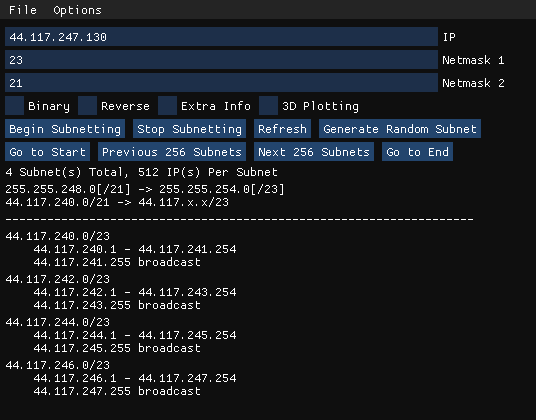

# Subnetter++

## Overview

Subnetter++ is a graphical interface for Subnetting and VLSM calculations written in C++. This tool has a variety of tools for learning how to subnet and calculating subnets.

## Compatibility

SubnetterGUI is designed for Windows x86-64, macOS arm64, and Linux x86-64. GLFW and GLEW are statically linked into this program with pre-compiled libraries. Due to limitations in GLFW's and GLEW's build process, other operating systems/architectures are not currently supported, and their library files are not included.

## Dependencies

Dependencies listed here are only for building this program yourself. Everything should work fine if you're using a prebuilt release. Should any of the build process dependencies be required for one of the releases anyway, please refer to this section.

This program uses the `ImGui` library and a 3D plotting extension for ImGui called `ImPlot3D`. To use the ImGui library, `GLFW` and `GLEW` are linked and initialized. ImGui is designed to run on top of a window platform, so it does not have any unique dependencies. GLFW and GLEW, however, will require various packages specifically on Linux. 

This application is designed to be built with MSVC on Windows and macOS systems, so please be sure to install [Build Tools for Visual Studio 2022](https://visualstudio.microsoft.com/downloads/).

Futhermore, this project requires `Visual Studio C++ Build Tools`, which can be found under ther `Desktop development with C++` section in the Visual Studio Build Tools Installer.
Install the following packages:
<ul>
    <li>MSVC VS 2022 C++ Build Tools</li>
    <li>Windows 10/11 SDK</li>
</ul>

For simply running the Windows release, make sure to install `Visual C++ Redistributable for Visual Studio 2015` if you machine doesn't have it already.

Instead of MSVC, Linux machines should use g++ to build this application. On Ubuntu-based Linux distributions, for example, the following packages are required:

```
cmake g++ libwayland-dev libxkbcommon-dev libglu1-mesa-dev freeglut3-dev mesa-common-dev xorg-dev
```
Note: `xwayland` is also recommended if your system uses Wayland by default to ensure Xorg compatibility.

Keep in mind that because this program uses GLFW to render windows, window resizing and decorating are not possible on Linux systems running the Wayland window manager. This is a limitation of GLFW itself. If you are on Wayland, it is strongly recommended to switch to Xorg for this program to work properly. Go [here](https://askubuntu.com/questions/1410256/how-do-i-use-the-x-window-manager-instead-of-wayland-on-ubuntu-22-04) for more information on how to do this.

Regardless, this application is designed to be built with `CMake`, which is required on all supported operating systems and compilers. CMake can be installed via a package manager, including the `choco` package manager on Windows.

## Building The Program

After ensuring your system is compatible and has all necessary dependencies, it can be built with CMake.

The `release-build.py` script will handle the cmake configuration and building automatically. To build with it, run:

```
python release-build.py
```

The binary will be dropped in the `build` folder under the name `subnettergui`.

## Installing Subnetter++ As An Application on Linux

There is an install script called `install.sh` that will install the subnettergui binary for the user that runs it. This will drop a desktop file in the user's application folder for easy access.

The program must be built before running the install script.

`uninstall.sh` will conversely uninstall the binary that was installed with the former script.

## How To Use The Program

Subnetter++ can be opened just like any other standalone executable program.

### Subnet Calculator

Subnetter++'s main function is to calculate subnets. This can be done from the main menu.

Enter an IP address and at least one subnet mask[^1] into the `IP`, `Netmask 1`, and `Netmask 2` input text fields respectively. The output will be shown in a scrolling text field below.

Below, four subnets under the address pool `44.117.240.0/21` are calculated:



Because VLSM can become quite large and unruly, only 256 subnets will be shown on-screen at a time. 

The `Go to Start`, `Previous 256 Subnets`, `Next 256 Subnets`, and `Go to End` buttons will change which block of 256 subnets are on-screen.

#### Calculator Flags

There are many different flags than can be toggled when calculating a subnet.

The `Binary` flag will show all IP addresses in binary format. 

The `Reverse` flag shows all subnets in reverse order.

The `Extra Info` flag will show some debug information such as what IP address is currently being stored in memory as a cursor for subnet calculations.

The `3D Plotting` flag will open a new tab with a visual representation of the subnet blocks associated with the entered subnet masks.

### Exporting Subnet Calculator Output

Subnetter++ also supports exporting subnets calculated in the main window. To do this, go to `File > Export` in the menu bar. Doing so will open a separate tab for exports. Then, enter the absolute path of a text file which will be created with the subnet data in it.

### Practicing Subnetting

You can also practice calculating subnets on your own. Go to `Tools > Study Subnetting` to get started.

The study tab asks for various pieces of information about any single subnet. It provides a CIDR mask and an IP address.

The tab has eight question boxes to be filled:

- The IP-formatted Subnet Mask
- The block size of the subnet
- The network ID of the subnet
- The first usable IP address of the subnet
- The last usable IP address of the subnet
- The broadcast IP address of the subnet
- The binary representation of the IP address provided in the question
- The binary representation of the CIDR mask provided in the question

The `Check Answers` button will check if each entered value is correct and show the results below. 

The `Show Answers` button will fill the text boxes with the correct answers.

The `Hide Answers` button will clear the text boxes.

The `Generate New Question` button will create a new question with a randomly generated IP address and CIDR mask.

If you have trouble answering any of these questions, the `Help > IP Info` and `Help > Subnet Mask Info` have more information about IP addressing and subnet schemes.

### Studying IP Classes

Before VLSM and CIDR were introduced, a type of addressing scheme called IP Classing was used where certain blocks of IP addresses would be assigned subnet masks.

To start studying IP classes, go to `Tools > IP Classes`. The IP Classes window will ask for the following information about a random IP address:

- The Class of the IP
- The Class's Subnet Mask

The `Check Answers`, `Show Answers`, `Hide Answers` and `Generate New Questions` buttons work the same in this window as they do in the subnetting practice window.

More information about IP classes can be found in the `Help > IP Class Info` section.

### Calculating IPv6 Address Properties

IPv6 addresses are different from IPv4 addresses, and standard subnetting does not work for them.

The tool for IPv6 calculations can be accessed from `Tools > IPv6 Tools`. This tool has two text boxes.

The first text box accepts any format of IPv6 address as input, and it outputs the different sections of that IPv6 address, including:
- The shorthand version of the address
- The long version of the address
- The address's prefix
- The address's subnet ID
- The address's interface ID
- The address's type

More information about IPv6 addresses can be found in the `Help > IPv6 Info` section.

The second text box accepts a MAC address as input. A process called EUI64 is done as an example, showing how link-local IPv6 addresses network can be generated for a LAN using MAC addresses instead of a DHCP server:
- An EUI64-generated interface ID using the inputted MAC address
- A full link-local IPv6 address created using the generated interface ID

More information about EUI64 can be found in the `Help > EUI64 Info` section.

[^1]: If one subnet mask is entered, a single subnet will be calculated. If two subnet masks are entered, VLSM will be calculated with the two subnet masks.
